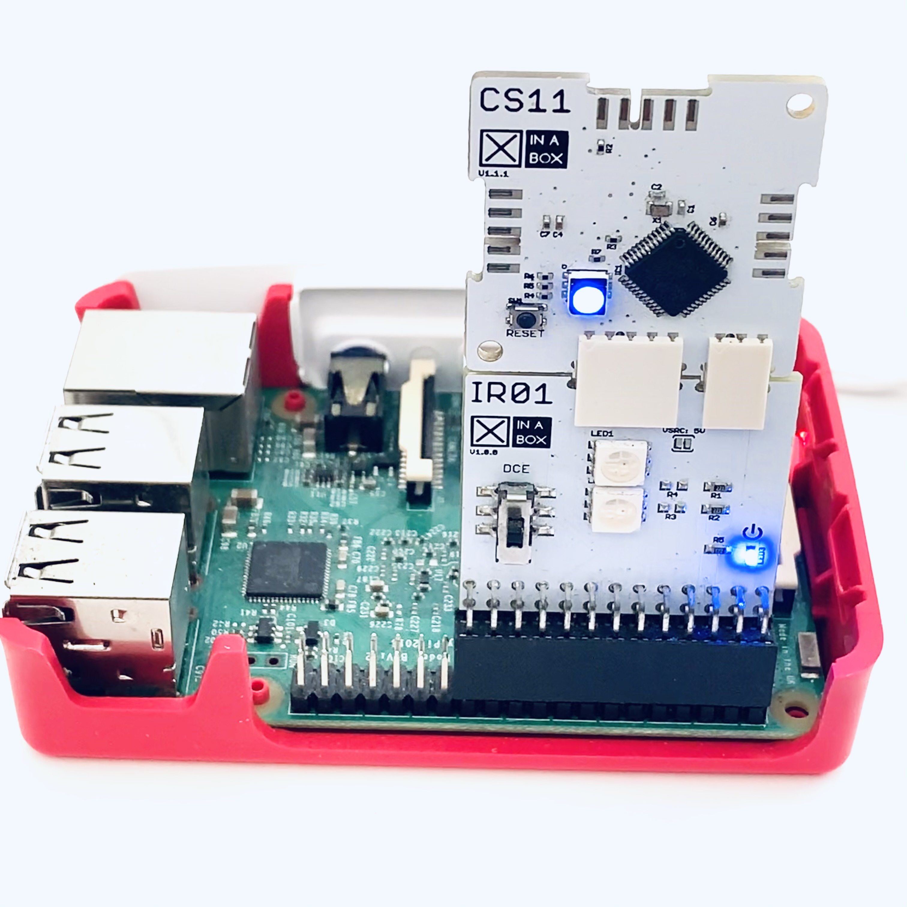

# IR01


## Install IR01 on the Raspberry Pi
1. The IR01 is inserted with the name `IR01` facing away from the center of the Raspberry Pi.
1. The header on the IR01 is inserted in to the Raspberry Pi starting with pin 1
1. See image to the right.

# OpenOCD
Using the IR01 as an OpenOCD SWD programmer for supported XinaBox Cores

## Install OpenOCD
Follow Adafruit's excellent indstructions found [here](https://learn.adafruit.com/programming-microcontrollers-using-openocd-on-raspberry-pi?view=all), until the point saying `That's pretty much it!`
There might be a simpler way, and if so, please post a pull request.

## Prepare OpenOCD for IR01
1. Change the SWD pin numbers:<br> `sudo nano /usr/local/share/openocd/scripts/interface/raspberrypi2-native.cfg`
1. Find `bcm2835gpio_swd_nums` and change to `bcm2835gpio_swd_nums 11 8`
1. Find and uncomment `bcm2835gpio_srst_num` and change to `bcm2835gpio_srst_num 4`
1. Exit: `^x`

## Flash bootloader to CS11
1. Insert the CS11 using two connectors (1x small and 1x large) as per the image above.
1. Create a suitable folder:<br> ```bash
cd ~
mkdir bootloaders
cd bootloaders
```
1. Download the CS11 Bootloader:<br> `wget https://github.com/xinabox/XinaBox-Bootloaders/raw/master/CS11/cs11_bootloader.bin` 
1. Download the CS11 Config file:<br> `wget https://raw.githubusercontent.com/xinabox/XinaBox-Bootloaders/master/CS11/openocd.cfg`
1. Run OpenOCD:<br> `sudo openocd -f openocd.cfg`

## Flash bootloaders to other xChip Cores
1. Go to the section above and replace CS11 with name of xChip Core.

## Notes
The OpenOCD you install will be the latest one, and the associated `openocd.cfg` might be out of date. You might need to change some parameters. If you do so, please don't hesitate to fire of a pulle request.
